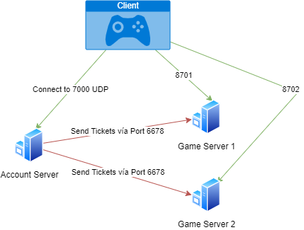

# Mir Eternal Files

## Help us to continue maintaining the project

### *If you have problems donating, try this other option*:
http://paypal.me/armifer

## Info

Originally, these sources were published on LOMCN in the following post:
https://www.lomcn.org/forum/threads/legend-of-mir-3d-emu-source-code.108580/

In this repository, we have done a refactoring, translation and correction work from the mentioned source.

## How to start

### Client & Launcher Configuration

First, a compatible client will need to be downloaded, for example:
* DOWNLOAD LINK UPDATED *
https://cq.dorado.sdo.com/downloader/cqyh_10409_downloader.exe

Latest version still compatible with this files **[1.0.4.14 (v1.72 - 191186)]** at July 11, 2023!

Once downloaded, you will need to copy the compiled binaries of the launcher to the root of the folder.

In launcher there is a configuration file called "ServerCfg.txt". In this file we must put our WAN IP and the AccountServer port (by default 7000), eg:

If it is locally: `127.0.0.1:7000`
If it is WAN: `<public_ip>:7000`

### Account Server Configuration

We will have to create a file in the root of the account server called "server" in which we will include a list of the GS that we will have raised, by default we will only have one, so we will have something like the following:

If it is locally: `127.0.0.1,8701/<ServerName>`
If it is WAN: `<public_ip>,8701/<ServerName>`

### Game Server Configuration

We must copy a valid system database in the "Database/System" folder.

It does not require changing the default config.

To publish on the internet, you must open ports 7000 and 8701 on your router

### Network Communication Diagram

# Special Thanks

- CraZyEriK
- Wincha
- Lilcooldoode
- Far
- Armifer (ElAmO)
